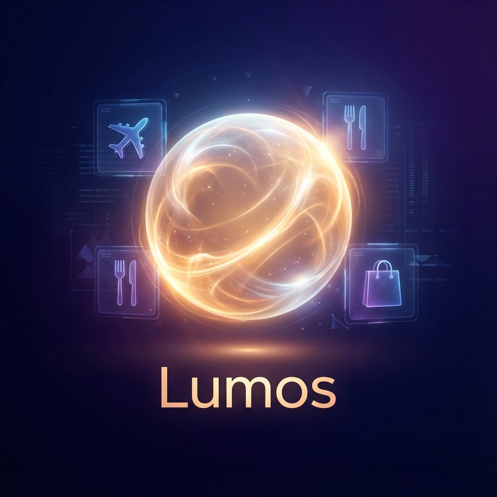
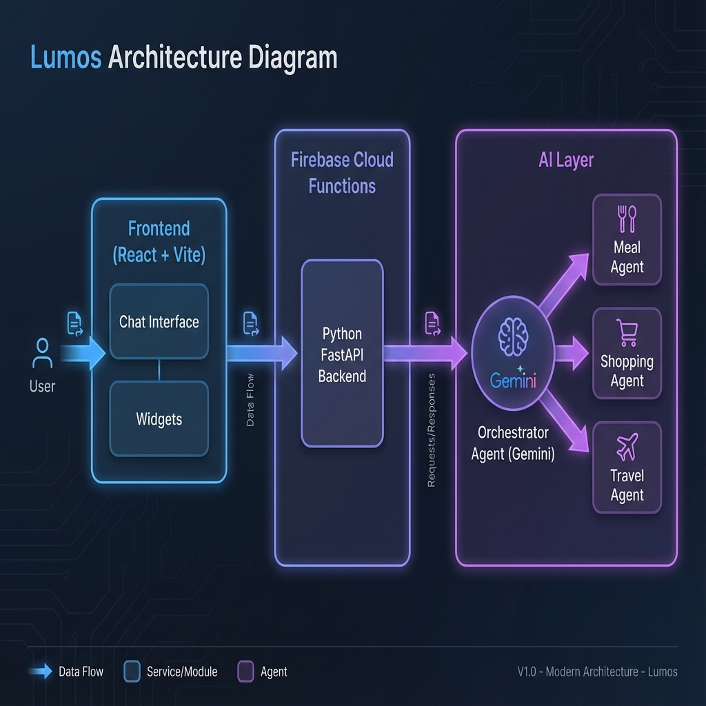
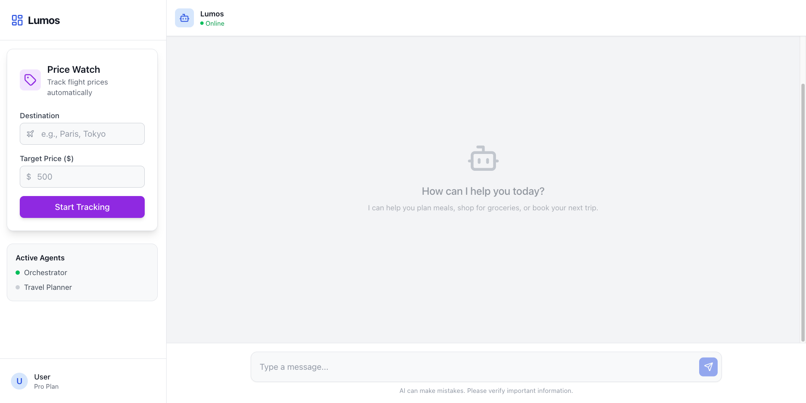

# Lumos: Your Personal AI Concierge

### Problem Statement
Modern life is a juggling act. We switch between a dozen apps just to manage our basic needs: a recipe app for dinner, a grocery app for ingredients, a travel site for vacations, and a calendar to fit it all in. This fragmentation creates cognitive load and friction. We spend more time *managing* our lives than actually *living* them. The problem isn't a lack of information; it's a lack of **integration and intelligent action**.

### Why agents?
Traditional software is rigid; it follows pre-defined paths. LLMs are creative but often lack the ability to execute complex, multi-step tasks reliably. **Agents** are the bridge. They are the right solution because:
1.  **Specialization:** We can have a "Meal Agent" that knows nutrition and a "Travel Agent" that understands flight logistics, rather than one monolithic model trying to do everything.
2.  **Tool Use:** Agents can actively search the web, query databases, and potentially perform actions (like booking), turning intent into reality.
3.  **Reasoning:** Agents can break down a high-level goal ("Plan a romantic weekend in Paris") into actionable steps (flights, hotels, dinner reservations) and execute them in order.

### What you created
I built **Lumos**, a unified personal concierge interface.

### Architecture Diagram

The system is built on a modern, event-driven architecture designed for scalability and intelligent reasoning:

1.  **Frontend (React + Vite):** The user interacts with a responsive web interface. It handles chat input and renders dynamic widgets (like price charts) in real-time.
2.  **Backend (Firebase Cloud Functions):** A serverless Python environment running **FastAPI**. It acts as the API gateway, receiving user requests and managing the session state.
3.  **Orchestrator Agent (The Brain):** The core of the system. This agent uses **Google Gemini** to analyze the user's natural language request. It determines *intent* (e.g., "Is this about food or travel?") and routes the task to the appropriate sub-agent.
4.  **Sub-Agents:** Specialized agents that perform specific tasks:
    *   🥦 **Meal Agent:** Expert in nutrition and recipes.
    *   🛒 **Shopping Agent:** Handles inventory and product search.
    *   ✈️ **Travel Agent:** Manages destination search and itinerary planning.

This modular design allows us to easily add new capabilities (like a "Calendar Agent") without rewriting the core logic.

### Demo

The application allows a user to say "Plan a vegetarian dinner for two and add the ingredients to my shopping list," and the system seamlessly coordinates between the Meal Agent (to pick the recipe) and the Shopping Agent (to list the items).

### The Build
I used a modern, scalable tech stack to build Lumos:
*   **AI Model:** Google Gemini (via Google AI SDK) for reasoning and generation.
*   **Backend:** Python & FastAPI, wrapped with `a2wsgi` for serverless deployment.
*   **Frontend:** React, TypeScript, and Tailwind CSS for a premium user experience.
*   **Infrastructure:** Firebase (Hosting for the web app, Cloud Functions for the backend).
*   **Tools:** `git` for version control, `npm` & `pip` for dependency management.

### If I had more time, this is what I'd do
1.  **Real API Integrations:** Connect the Travel Agent to real flight APIs (like Amadeus or Skyscanner) and the Shopping Agent to Instacart/Amazon for actual purchasing.
2.  **User Authentication:** Implement Firebase Auth to save user preferences, dietary restrictions, and past trips securely.
3.  **Voice Interface:** Add speech-to-text and text-to-speech so users can talk to Lumos while cooking or driving.
4.  **Proactive Suggestions:** Have the agents run in the background (using Cloud Tasks) to find flight deals or suggest recipes based on what's already in the fridge.
